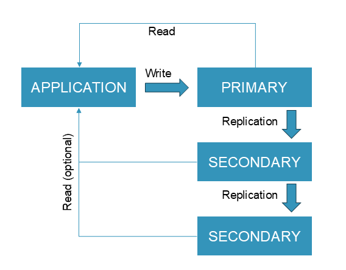
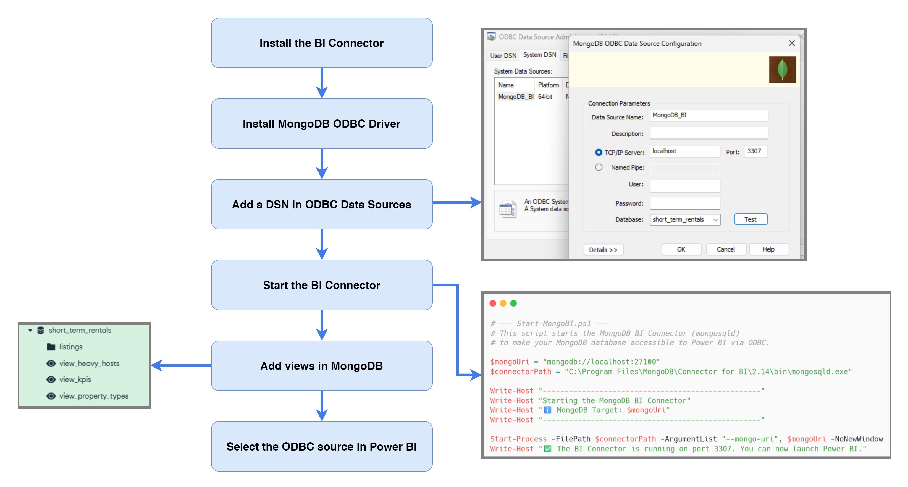

# 🏗️ MongoDB Distributed Data Platform for Short-Term Rental Analytics

> **Overview** — A critical database crash on a production MongoDB instance triggered a full intervention: restore the data, validate its integrity, expose it to a BI tool, and redesign the entire architecture to prevent any future incident. This project covers the end-to-end journey from emergency recovery to a production-grade distributed NoSQL cluster, using **MongoDB**, **Python/Polars**, **Docker**, and **Power BI**.

Disaster recovery · NoSQL analytics · ReplicaSet HA · Geo-distributed Sharding


[](assets/presentation.pdf)

---

## 🎯 The Challenge

> *Simulated business case — NosCités is a fictional French non-profit association used as the project scenario.*

**NosCités** monitors short-term rental platforms (Airbnb-type) to measure their impact on housing availability in Paris and Lyon. The association self-hosts its infrastructure to ensure data independence and confidentiality — no cloud provider.

On day one as the new Data Engineer, the **Paris database crashes completely**. Root cause: a single point of failure, no replication, no redundancy. The context makes it urgent: the association needs the data to produce a report on the **2024 Olympic Games effect** on Parisian housing supply, to be submitted to public authorities.

Three missions, in order of priority:

1. **Restore** — recover and import the backup, validate data integrity against the last known report
2. **Analyse** — run MongoDB queries and advanced Polars statistics, expose results via Power BI
3. **Redesign** — merge Paris + Lyon into a unified collection, deploy a ReplicaSet for high availability, and implement geo-distributed sharding

---

## 💡 The Solution & Architecture

### Phase 1 — Data Restoration & Analysis

The Paris backup (CSV) was imported into MongoDB, followed by the Lyon dataset. Several data quality issues were identified during exploration (e.g., `price` stored as `"$120.00"`, rate fields stored as `"75%"`), but no cleaning was required since the analysis queries did not depend on these fields. The only post-import transformation was adding the `city: "Lyon"` field to Lyon listings, which the source CSV did not include.

### Why NoSQL? The Benefits of MongoDB for this Dataset

The flexible, semi-structured nature of the Airbnb dataset makes MongoDB a superior choice over a traditional relational (SQL) database. Here is a breakdown of the key advantages observed during the initial analysis:

| Key Feature | Observation | Advantage vs. SQL |
| :--- | :--- | :--- |
| **Complex Data Structures** (`amenities`, `host_verifications`) | Nested data like lists of amenities are stored natively as **Arrays** within a single document. | **Eliminates the need for complex joins.** In SQL, this would require a separate `listing_amenities` join table, making queries slower and more complex. |
| **Flexible & Dynamic Schema** (`calendar_updated`, `neighbourhood_group_cleansed`) | Fields that are empty in the source data do not need to exist in the document. The schema is enforced on write, not predefined. | **Avoids sparse tables with excessive `NULL` values.** This leads to more efficient storage and a cleaner data model that can easily evolve without `ALTER TABLE` migrations. |
| **Intelligent Type Inference** (`has_availability`, `instant_bookable`) | During import, MongoDB automatically converted boolean-like strings (e.g., `'t'`/`'f'`) into native **Boolean** types. | **Reduces the need for pre-processing.** This streamlined the data loading pipeline, whereas a strict SQL schema would have required an ETL step to clean and cast these values beforehand. |
| **Native Web Data Format** (overall document structure) | The source data, often scraped from web APIs, is already in a JSON-like format, which maps directly to MongoDB's **BSON** document model. | **Seamless data integration.** MongoDB speaks JSON and JavaScript natively, making it the ideal backend for web applications and data from web sources, minimizing transformation overhead. |

### Phase 2 — Distributed Architecture

Two architectures are explored sequentially. Phase 2a addresses the immediate high-availability need; Phase 2b is the **target production architecture** that supersedes it by embedding ReplicaSets within each shard.

#### Phase 2a — ReplicaSet (Intermediate HA Architecture)

A 3-node ReplicaSet (`rs_noscites`) was deployed via Docker Compose as a direct response to the single point of failure that caused the Paris crash. The PSS (Primary + 2 Secondary) topology was chosen over PSA (Primary + Secondary + Arbiter) to ensure read scalability and stronger fault tolerance, at the cost of higher resource usage.



#### Phase 2b — Sharded Cluster (Target Architecture)

The Paris and Lyon datasets were merged into a single `listings` collection with a `city` field added to each document. **Tag-Aware Sharding** (zone sharding) was implemented with `city` as the shard key, guaranteeing total data isolation between the two cities.


| Aspect | Decision |
| :--- | :--- |
| Shard Key | `city` field |
| Sharding Strategy | Tag-Aware (Zone Sharding) |
| Query Optimization | Targeted queries — Paris team only hits Paris shard |
| Data Isolation | Total — each city's data on its own geographic shard |
| Total Documents | 105,858 (95,885 Paris + 9,973 Lyon) |

### Phase 3 — Business Intelligence Pipeline

> ⚠️ **Windows only** — Power BI Desktop and the MongoDB BI Connector are not available on Linux or Mac.

Once the unified `listings` collection was in place on the sharded cluster, the data was exposed to Power BI via the **MongoDB BI Connector**:



Three MongoDB views were created on the `listings` collection to pre-aggregate data for Power BI:

- `view_kpis` — global KPIs (total listings, availability rate, instant bookable %, superhosts)
- `view_property_types` — listing count by property type
- `view_heavy_hosts` — hosts with more than 100 listings ("professional hosts")

---

## ⚠️ Security Notice

This setup has **no authentication enabled** and is intended for **local development only**. Do not expose these containers to the internet as-is.

For a production deployment, the following should be added:

- MongoDB keyfile authentication between all cluster members (ReplicaSet and Sharded Cluster)
- User credentials with role-based access control (RBAC)
- TLS encryption for all connections

---

## 🛠️ Tech Stack

| Category | Tool / Technology |
| :--- | :--- |
| **Database** | MongoDB 7.0, mongosh CLI, MongoDB Compass |
| **Scripting** | JavaScript (MongoDB shell scripts `.mongodb.js`) |
| **Python** | Python 3.13, PyMongo, Polars, Jupyter Notebook |
| **Dependency Management** | Poetry (`pyproject.toml`) |
| **Infrastructure** | Docker, Docker Compose |
| **Business Intelligence** | Power BI Desktop, MongoDB BI Connector, ODBC |
| **Shell** | Bash (init scripts), PowerShell (Windows BI Connector launcher) |

---

## 📦 Data

Data files are **not included** in this repository. The dataset comes from [Inside Airbnb](https://insideairbnb.com/get-the-data/), an open-source project providing publicly available Airbnb listing data.

> ⚠️ Inside Airbnb only provides the **last 12 months** of data. This project was built using **2024 data** (Paris & Lyon scrapes from June 2024). If you download current data, the scripts and architecture will work identically but **the numbers and results will differ** from those presented in this project.

Download the listings files for **Paris** and **Lyon**, rename them as follows, and place them in the `data/` folder:

```text
data/
├── listings_Paris.csv
└── listings_Lyon.csv
```

---

## 🚀 How to Run

> **Prerequisites:** Docker & Docker Compose, Python 3.13+, Poetry, [MongoDB Compass](https://www.mongodb.com/try/download/compass)
>
> **MongoDB CLI tools** (`mongosh`, `mongorestore`) must be installed separately:
>
> - `mongosh` → [mongodb.com/try/download/shell](https://www.mongodb.com/try/download/shell)
> - `mongorestore` → part of [MongoDB Database Tools](https://www.mongodb.com/try/download/database-tools) (separate package from `mongosh`)
>
>
> On Ubuntu 22.04, add the MongoDB repo first:
>
> ```bash
> curl -fsSL https://www.mongodb.org/static/pgp/server-7.0.asc | sudo gpg -o /usr/share/keyrings/mongodb-server-7.0.gpg --dearmor
> echo "deb [ arch=amd64,arm64 signed-by=/usr/share/keyrings/mongodb-server-7.0.gpg ] https://repo.mongodb.org/apt/ubuntu jammy/mongodb-org/7.0 multiverse" | sudo tee /etc/apt/sources.list.d/mongodb-org-7.0.list
> sudo apt-get update && sudo apt-get install -y mongodb-mongosh mongodb-database-tools
> ```

```bash
# Clone the repository
git clone https://github.com/abguven/mongodb-nosql-airbnb.git
cd mongodb-nosql-airbnb
```

### Phase 1 — Standalone Analysis

The simplest entry point. Run a local MongoDB instance and import the Paris data using **MongoDB Compass** to preserve correct field types (booleans, dates).

1. Install Python dependencies

   ```bash
   poetry install
   ```

2. Start a local MongoDB instance (port 27017)

   ```bash
   docker run -d --name mongo-standalone -p 27017:27017 mongo:7.0
   ```

3. Import Paris data via MongoDB Compass:
   - Open Compass → connect to `mongodb://localhost:27017`
   - Database: `short_term_rentals` / Collection: `paris_listings`
   - Import `data/listings_Paris.csv` with the following type overrides:
     - Mixed-type columns (`amenities`, `host_verifications`) → force to **String**
     - `id` column → force to **Long**
   - Compass will automatically infer booleans (`has_availability`, `instant_bookable`) and dates

   > ⚠️ Do not use `mongoimport` for this step — it imports all fields as strings, which will break the analysis queries that filter on boolean fields.

4. Run analysis scripts

   ```bash
   mongosh --file standalone/analysis_queries.mongodb.js
   ```

5. Open the notebook for advanced Polars analytics

   ```bash
   jupyter notebook standalone/notebooks/analyse.ipynb
   ```

6. Merge Paris and Lyon into a unified collection:
   - In Compass, import `data/listings_Lyon.csv` into `short_term_rentals` / `lyon_listings` (same type overrides: `amenities` and `host_verifications` → **String**, `id` → **Long**)
   - Run the merge script — it tags both collections with their `city` field, merges them into `listings`, and verifies the result:

   ```bash
   mongosh --file standalone/merge_collections.mongodb.js
   ```

   - The original `paris_listings` and `lyon_listings` collections are kept for integration testing. Drop them manually once verified (instructions at the bottom of the script).

7. Dump the `listings` collection to prepare for Phases 2 and 3:

   ```bash
   # Linux / Mac
   mongodump --uri="mongodb://localhost:27017" \
     --db="short_term_rentals" \
     --collection="listings" \
     --out="standalone/dump_noscites"

   # Windows (PowerShell)
   mongodump --uri="mongodb://localhost:27017" `
     --db="short_term_rentals" `
     --collection="listings" `
     --out="standalone/dump_noscites"
   ```

See [standalone/README.md](standalone/README.md) for details on the analysis scripts and notebook.

### Phase 2a — ReplicaSet (High Availability)

> **Prerequisite:** Complete all of Phase 1 first. Copy the generated `dump_noscites/` folder into `replicaset/scripts/` before proceeding.
>
> **Note:** Phase 2a can be deployed independently if you only need high availability without geo-distribution. In this project, it is superseded by Phase 2b — the two should not run simultaneously in production.

```bash
cd replicaset/
docker compose up -d
```

See [replicaset/README.md](replicaset/README.md) for the full procedure: ReplicaSet initialization, data restore, and verification.

### Phase 2b — Sharded Cluster (Full Distributed Architecture)

> **Prerequisite:** Complete all of Phase 1 first — the dump already contains the full `listings` collection (Paris + Lyon merged).
>
> **Note:** The sharded cluster embeds its own ReplicaSets at each shard level, providing both high availability and geo-distribution. It supersedes Phase 2a and is the final production architecture for this project.

```bash
# If Phase 2a is still running, stop it first
cd replicaset/
docker compose down

cd ../sharding/
docker compose up -d
```

See [sharding/README.md](sharding/README.md) for the full procedure: cluster initialization, data restore, and shard distribution verification.

### Phase 3 — Business Intelligence (Power BI)

> ⚠️ **Windows only** — Power BI Desktop and the MongoDB BI Connector are not available on Linux or Mac.

```bash
cd business_intelligence/

# 1. Install MongoDB BI Connector (see MongoDB official docs)
# 2. Launch the BI Connector (targets the sharded cluster router on port 27100)
./scripts/start_mongo_bi.ps1

# 3. Create MongoDB views for Power BI
mongosh --port 27100 --file scripts/create_views_sharded.mongodb.js

# 4. Open visualisation.pbix in Power BI Desktop
#    → Connect via ODBC DSN "MongoDB_BI" on port 3307
```

See [business_intelligence/README.md](business_intelligence/README.md) for the full procedure including dashboard preview.

---

## 🎤 Project Presentation

The full project presentation (architecture decisions, KPI results, live demos) is available as a PDF:

> 📎 [View Presentation (PDF)](assets/presentation.pdf) — *Note: the presentation is in French.*

---

## 🧠 Technical Challenges Overcome

### 1. Data Type Inconsistencies at Import

The raw CSV had several fields that resisted automatic type inference: `price` stored as `"$120.00"`, rate fields stored as `"75%"`, and `host_verifications` stored as a plain string representation of an array (e.g., `"['email', 'phone']"`). These issues were identified and documented during the exploratory phase. Since none of the required analysis queries depended on these fields, cleaning was intentionally deferred — a pragmatic decision to avoid unnecessary transformations and keep the import pipeline simple.

### 2. MongoDB Aggregation vs. Polars — Knowing Which Tool to Use

MongoDB's aggregation pipeline handles most queries well, but computing **statistical medians** and **monthly booking rates** across 95k+ documents required moving data into a Polars DataFrame. The key decision: use `PyMongo` to extract a cursor, convert to Polars, and leverage its in-memory columnar engine for the heavy statistics. This avoided the complexity of implementing a median in pure MongoDB aggregation syntax.

### 3. MongoDB BI Connector Configuration

Connecting Power BI to MongoDB is non-trivial: it requires installing the BI Connector, setting up an ODBC DSN, creating MongoDB views to present flat relational-like tables to the SQL layer, and starting the `mongosqld` process. The `create_views_sharded.mongodb.js` script creates three MongoDB views on the sharded cluster, filtered on `city = "Paris"`, to expose flat relational-like tables to Power BI.

### 4. ReplicaSet Topology Choice — PSS vs. PSA

Choosing PSS (Primary + 2 Secondary) over PSA (Primary + Secondary + Arbiter) was a deliberate trade-off. PSA uses fewer resources but the Arbiter holds no data — one secondary failure leaves the set with no redundancy. Given the context (a prior crash with data loss), PSS was the defensible choice despite higher infrastructure cost.

### 5. Tag-Aware Sharding Design

The naive approach would have been to shard by `_id` (hash-based), which would have distributed Paris and Lyon data randomly across both shards. Instead, **zone sharding on `city`** guarantees that Paris queries are served entirely by the Paris shard and Lyon queries by the Lyon shard — critical for local team performance and data sovereignty. The tradeoff: data is intentionally imbalanced (~90% Paris / ~10% Lyon), which is acceptable given the business requirement.
