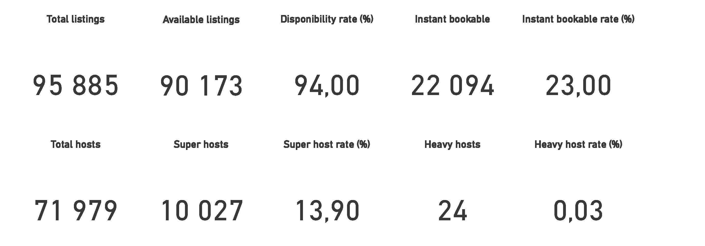
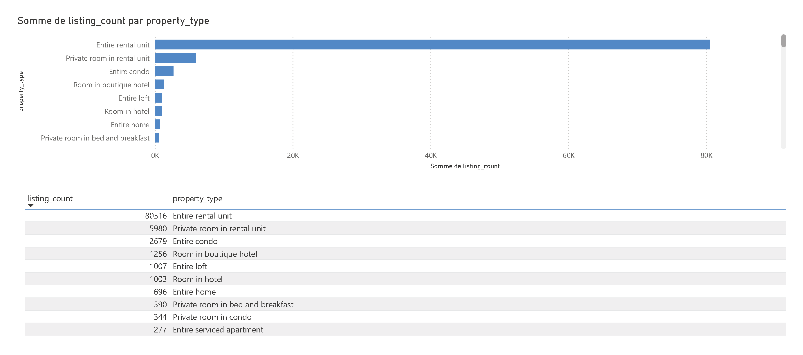
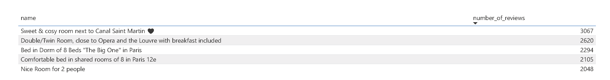
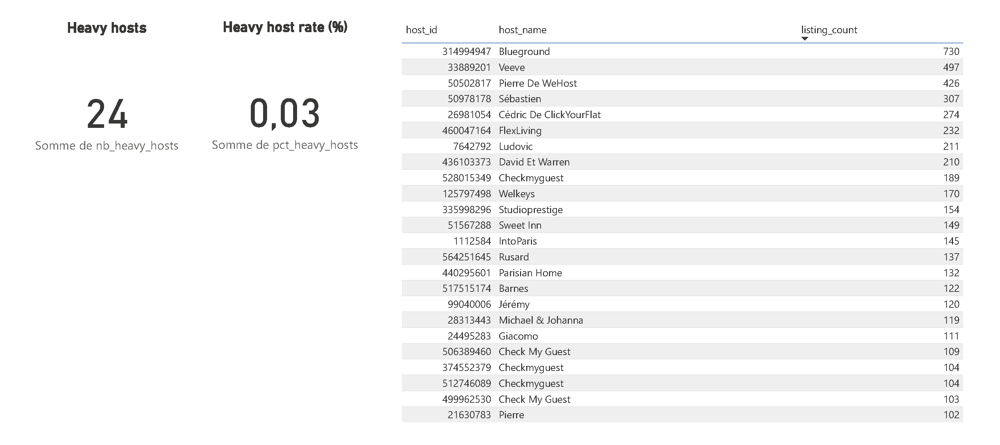

# Business Intelligence

This folder contains everything needed to connect Power BI to the MongoDB cluster and visualise the short-term rental KPIs.

## Prerequisites

- **MongoDB BI Connector** installed on your machine ([download here](https://www.mongodb.com/try/download/bi-connector))
- **ODBC Data Source** configured with the name `MongoDB_BI` pointing to `localhost:3307`
- **Power BI Desktop** installed
- The sharded cluster running and loaded with data (Phase 2b complete)

## Files

| File | Purpose |
| :--- | :--- |
| `scripts/start_mongo_bi.ps1` | Launches the BI Connector targeting the sharded cluster router (`port 27100`) |
| `scripts/create_views_sharded.mongodb.js` | Creates MongoDB views on the sharded cluster — filters on `city = "Paris"` |
| `visualisation.pbix` | Power BI dashboard ([Google Drive](https://drive.google.com/uc?export=download&id=1ynX811V3tr7LpRToZNHfyDX-CcaXQH-C)) — 4 tabs: KPIs, Property Types, Top 5 by Reviews, Professional Hosts |

## How to Run

### Step 1 — Create the MongoDB views

```bash
mongosh --port 27100 --file scripts/create_views_sharded.mongodb.js
```

This creates 3 views in the `short_term_rentals` database:

- `view_kpis` — global KPIs (total listings, availability rate, instant bookable %, superhosts, professional hosts)
- `view_property_types` — listing count by property type
- `view_heavy_hosts` — hosts with more than 100 listings

### Step 2 — Start the BI Connector

```powershell
# Windows only — targets the sharded cluster router on port 27100
.\scripts\start_mongo_bi.ps1
```

> The BI Connector exposes MongoDB as a SQL endpoint on **port 3307**, which Power BI can query via ODBC.

### Step 3 — Open the dashboard

Download `visualisation.pbix` from [Google Drive](https://drive.google.com/uc?export=download&id=1ynX811V3tr7LpRToZNHfyDX-CcaXQH-C) and open it in Power BI Desktop. If prompted for a data source, select the ODBC source `MongoDB_BI`.

## Dashboard Preview

### Overview (KPIs)



### Property Types



### Top 5 Listings by Reviews



### Professional Hosts


