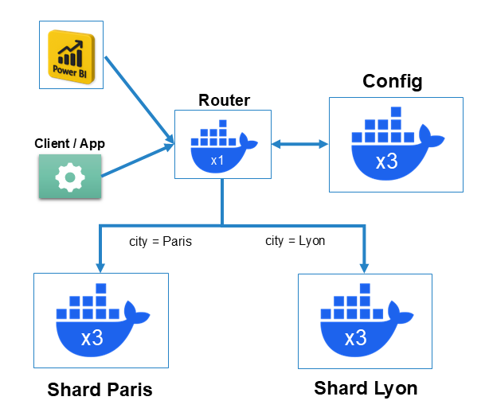

# Sharding — Geo-Distributed Cluster

This folder contains the full configuration for the production-grade sharded MongoDB cluster. It deploys **10 containers** via Docker Compose and distributes the `listings` collection across two geographic shards using **Tag-Aware (Zone) Sharding**.

## Architecture



| Component | Replica Set | Containers | Ports |
| :--- | :--- | :--- | :--- |
| Config Server | `noscites_cfg_rs` | `noscites-cfg1/2/3` | 27071–27073 |
| Shard Paris | `noscites_shard1_rs` | `noscites-shard1-1/2/3` | 27081–27083 |
| Shard Lyon | `noscites_shard2_rs` | `noscites-shard2-1/2/3` | 27091–27093 |
| Router (mongos) | — | `noscites-mongos` | **27100** |
| Admin Client | — | `noscites-client` | — |

## Sharding Strategy

**Tag-Aware Sharding** (Zone Sharding) on the `city` field guarantees total data isolation between cities:

- Documents where `city = "Paris"` → always routed to `noscites_shard1_rs`
- Documents where `city = "Lyon"` → always routed to `noscites_shard2_rs`

This ensures each city's team only hits its local shard, optimizing both query performance and data locality.

> ⚠️ Before running this cluster, complete all of Phase 1. The `dump_noscites/` folder produced at the end of Phase 1 already contains the full merged `listings` collection (Paris + Lyon). See [`standalone/README.md`](../standalone/README.md).

## How to Run

### Step 1 — Start all containers

```bash
docker compose up -d
```

### Step 2 — Initialize the cluster

Run the init script **from inside the client container**. It is fully automated and idempotent — it initializes all three ReplicaSets, elects Primaries, registers the shards with the router, configures the zones, and enables sharding on the collection.

```bash
docker exec -it noscites-client bash
bash /scripts/init-sharding.sh
exit
```

The script runs 6 steps in order:

1. Initialize Config Server ReplicaSet (`noscites_cfg_rs`)
2. Initialize Shard Paris ReplicaSet (`noscites_shard1_rs`)
3. Initialize Shard Lyon ReplicaSet (`noscites_shard2_rs`)
4. Register both shards with the `mongos` router
5. Configure zones and tag ranges (`city = "Paris"` → Paris shard, `city = "Lyon"` → Lyon shard)
6. Create the index on `city` and shard the `listings` collection

### Step 3 — Restore data

The dump produced at the end of Phase 1 already contains the full `listings` collection (Paris + Lyon merged). Restore it from the project root:

```bash
mongorestore --uri="mongodb://localhost:27100" \
  --db="short_term_rentals" --collection="listings" \
  "../standalone/dump_noscites/short_term_rentals/listings.bson"
```

### Step 4 — Verify shard distribution

```bash
mongosh --port 27100

use short_term_rentals
db.listings.getShardDistribution()
```

Expected output: ~90% of documents on the Paris shard, ~10% on the Lyon shard.

## Scripts

| File | Purpose |
| :--- | :--- |
| `scripts/init-sharding.sh` | Full automated cluster initialization (idempotent) |
